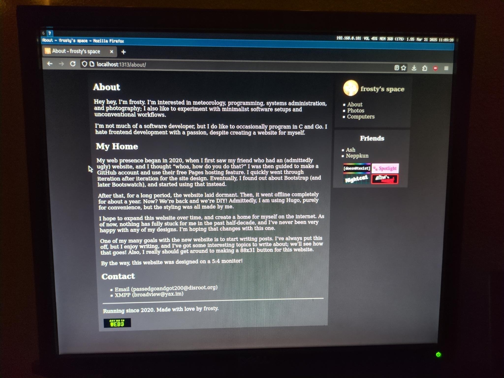

Hey hey, I’m frosty. I’m interested in meteorology, programming, systems administration, and photography; I also like to experiment with minimalist software setups and unconventional workflows.

I'm not much of a software developer, but I do like to occasionally program in C and Go. I hate frontend development with a passion, despite creating a website for myself.

## Contact

* [Email (passedgoandgot200@disroot.org)](mailto:passedgoandgot200@disroot.org)
* [XMPP (broadview@yax.im)](xmpp:broadview@yax.im)

## My Home

My web presence began in 2020, when I first saw my friend who had an (admittedly ugly) website, and I thought "whoa, how do you do that?" I was then guided to make a GitHub account and use their free Pages hosting feature. I quickly went through iteration after iteration for the site design. Eventually, I found out about Bootstrap (and later Bootswatch), and started using that instead.

After that, for a long period, the website laid dormant. Then, it went offline completely for about a year. Now? We're back and we're DIY! Admittedly, I am using Hugo, purely for convenience, but the styling was all made by me.

I hope to expand this website over time, and create a home for myself on the internet. As of now, nothing has fully stuck for me in the past half-decade, and I've never been very happy with any of my designs. I'm hoping that changes with this one.

One of my many goals with the new website is to start writing posts. I've always put this off, but I enjoy writing, and I've got some interesting topics to write about; we'll see how that goes! Also, I really should get around to making a 88x31 button for this website.

By the way, this website was designed on a 5:4 monitor!

